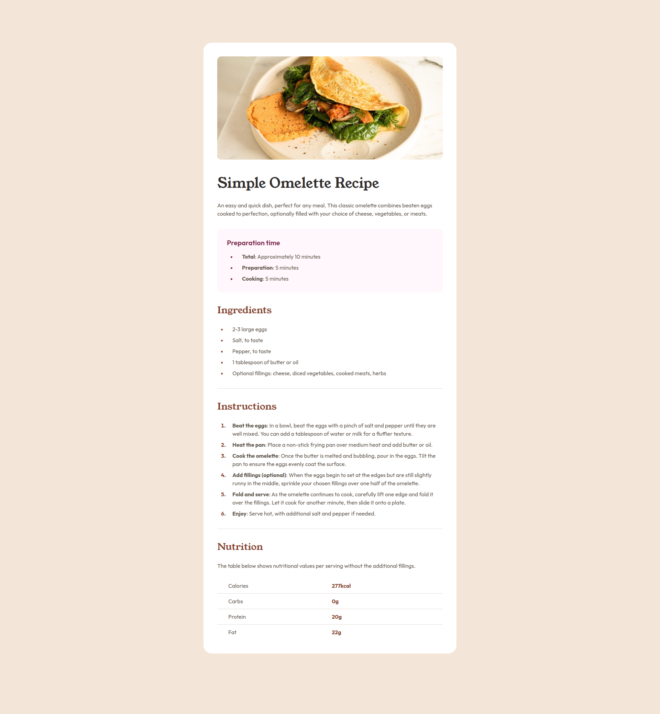
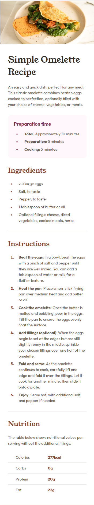

# Frontend Mentor - Recipe page solution

This is a solution to the [Recipe page challenge on Frontend Mentor](https://www.frontendmentor.io/challenges/recipe-page-KiTsR8QQKm). Frontend Mentor challenges help you improve your coding skills by building realistic projects.

## Table of contents

- [Overview](#overview)
  - [The challenge](#the-challenge)
  - [Screenshot](#screenshot)
  - [Links](#links)
- [My process](#my-process)
  - [Built with](#built-with)
  - [What I learned](#what-i-learned)
  - [Continued development](#continued-development)
  - [Useful resources](#useful-resources)
- [Author](#author)

## Overview

### Screenshot

**Note: Delete this note and the paragraphs above when you add your screenshot. If you prefer not to add a screenshot, feel free to remove this entire section.**

### Links

- Solution URL: [https://github.com/jc-ve/front-end-mentor-challenges/tree/main/projects/newbie/recipe-page](https://github.com/jc-ve/front-end-mentor-challenges/tree/main/projects/newbie/recipe-page)
- Live Site URL: [https://jc-ve.github.io/front-end-mentor-challenges/projects/newbie/recipe-page/](https://jc-ve.github.io/front-end-mentor-challenges/projects/newbie/recipe-page/)

## My process

### Built with

- Semantic HTML5 markup
- Flexbox
- SASS

## Author

- Website - [John Christopher Enriquez](https://www.your-site.com)
- Frontend Mentor - [@jc-ve](https://www.frontendmentor.io/profile/jc-ve)
